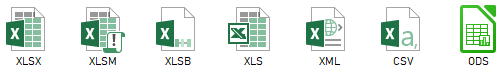
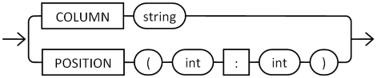
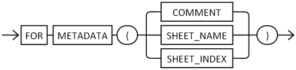

# ExcelTable - An Oracle SQL Interface for MS Excel, ODF Spreadsheet and Flat Files
<p align="center"></p>

ExcelTable is a pipelined table interface to read Excel files (.xlsx, .xlsm, .xlsb, .xls, .xml), ODF spreadsheet files (.ods), and flat files (delimited or positional) as if they were external tables.  
It is primarily implemented in PL/SQL using an object type (for the ODCI routines) and a package supporting the core functionalities.

## Content
* [What's New in...](#whats-new-in)  
* [Bug tracker](#bug-tracker)  
* [Installation](#installation)  
* [Quick Start](#quick-start)
* [ExcelTable Subprograms and Usage](#exceltable-subprograms-and-usage)  
  * [Columns syntax specification](#columns-syntax-specification)
  * [Range syntax specification](#range-syntax-specification)
  * [Cryptographic features overview](#cryptographic-features-overview)
  * [Examples](#examples)
* [CHANGELOG](#changelog)  


## What's New in...
> Version 5.0 :  
> Support for strict OOXML documents  
> Streaming read method for ODF files  
> Raw cells listing  

> Version 4.0 : 
> Support for delimited and positional flat files

> Version 3.2 : 
> ExcelTable can read XML spreadsheetML files (.xml)

> Version 3.1 : 
> New default value feature in DML API

> Version 3.0 : 
> Multi-sheet support

> Version 2.3 : 
> New API for DML operations

> Version 2.2 : 
> ExcelTable can read ODF (OpenDocument) spreadsheet files (.ods).  
> Support for TIMESTAMP data type

> Version 2.1 : ExcelTable can read .xlsb files.

> Version 2.0 : ExcelTable can read old 97-2003 Excel files (.xls).

## Bug tracker

Found a bug, have a question, or an enhancement request?  
Please create an issue [here](https://github.com/mbleron/ExcelTable/issues).

## Installation

### Getting source code

Clone this repository or download it as a zip archive.

[ExcelCommons](https://github.com/mbleron/ExcelCommons) and [MSUtilities](https://github.com/mbleron/MSUtilities) dependencies are now provided as submodules.

* If you choose to clone the repository, use the following command to fetch the submodule automatically :  
`git clone --recurse-submodules https://github.com/mbleron/ExcelTable.git`  

* If you go the download way, please also get [ExcelCommons](https://github.com/mbleron/ExcelCommons) and [MSUtilities](https://github.com/mbleron/MSUtilities) zip archives and extract the content of their root folders into ExcelCommons and MSUtilities folders respectively.

### Database requirement

ExcelTable requires Oracle Database 11\.2\.0\.1 and onwards.
> Note that the interface may work as well on versions 11\.1\.0\.6 and 11\.1\.0\.7, with limited support for CLOB projections, but that scenario has not been tested.

### DBA preliminary tasks

On database versions prior to 11\.2\.0\.4, a temporary XMLType table is used internally to read .xlsx files with the default DOM method.
The owner requires the CREATE TABLE privilege in this case : 
```sql
grant create table to <user>;
```
---  
In order to read encrypted files, the interface requires access to the DBMS_CRYPTO API (see PL/SQL section below).  
The owner must therefore be granted EXECUTE privilege on it : 
```sql
grant execute on sys.dbms_crypto to <user>;
```
---  
ExcelTable requires CURSOR_SHARING parameter set to EXACT, otherwise one may receive the following error when using ODCI-based function getRows() : 
```
PLS-00307: too many declarations of 'ODCITABLEDESCRIBE' match this call
```
The current value can be checked using this query : 
```sql
select value from v$parameter where name = 'cursor_sharing';
```
If the value is not 'EXACT' then it can be changed at system or session level using the corresponding ALTER SYSTEM/SESSION command, e.g.
```sql
alter session set cursor_sharing = exact;
```
If this change is not possible, the workaround is to override the parameter at query level via a hint : 
```
select /*+ cursor_sharing_exact */ t.*
from table(
       ExcelTable.getRows( ... )
     ) t
;
```
  

### PL/SQL

Using SQL*Plus, connect to the target database schema and run script [`install.sql`](./install.sql).


### Java

ExcelTable requires additional Java classes for the following features : 

* Streaming read method for .xlsx/.xlsm files
* Reading password-protected ODF spreadsheets encrypted using the Blowfish algorithm (ODF 1.0/1.1)

JAR files to deploy depend on the database version : 

:warning: **As of ExcelTable 5.0, Java-based features are desupported on database versions < 11\.2\.0\.4**  
If necessary, you may create an [issue](https://github.com/mbleron/ExcelTable/issues) and request a backport for your version.
Otherwise, please use the last compatible release [ExcelTable 4.0.1](https://github.com/mbleron/ExcelTable/releases/tag/v4.0.1).  

* Versions < 11\.2\.0\.4  
Except for version 11\.2\.0\.4 which supports JDK 6, Oracle 11g only supports JDK 5 (Java 1.5).
The following jar files are required in order to use the streaming method : 
  + [stax-api-1.0-2.jar](./java/lib/stax-api-1.0-2.jar)  
  + [sjsxp-1.0.2.jar](./java/lib/sjsxp-1.0.2.jar)  
  + [exceldbtools-1.5.jar](./java/lib/exceldbtools-1.5.jar)

Run shell script [`install_jdk5.bat`](./java/install_jdk5.bat) on Windows, or [`install_jdk5.sh`](./java/install_jdk5.sh) on a UNIX-like machine to load them in the database.  
You will be prompted for connect information : database SID, user and password.

* Versions >= 11\.2\.0\.4  
The StAX API is included in JDK 6, as well as the Sun Java implementation (SJXSP), so for those versions one only needs the following jar file :  
  + [exceldbtools-1.6.jar](./java/lib/exceldbtools-1.6.jar)

Run shell script [`install_jdk6.bat`](./java/install_jdk6.bat) (or [`install_jdk6.sh`](./java/install_jdk6.sh)) to load it in the database.

Both scripts use `loadjava` utility, available from a standard Oracle client or database installation ($ORACLE_HOME/bin).  
It is recommended to use a client version at least equal to the target database version to avoid compatibility issues.


## Quick Start

Reading an Excel file using default settings : 
```sql
SELECT t.* 
FROM Table(
       ExcelTable.getRows(
         ExcelTable.getFile('MY_DIR','my_file.xlsx')
       , 'my_sheet'
       , ' "COL1"  number
         , "COL2"  varchar2(10)
         , "COL3"  number
         , "COL4"  date
         , "COL5"  number(3)'
       )
     ) t
;
```
Reading a delimited flat file (e.g. csv) : 
```sql
SELECT t.* 
FROM Table(
       ExcelTable.getRows(
         p_file => ExcelTable.getTextFile('MY_DIR','my_file.csv')
       , p_cols => q'{
                     "COL1" number
                   , "COL2" varchar2(50)
                   , "COL3" varchar2(50)
                   , "COL4" number
                   , "COL5" date format 'DD/MM/YYYY HH24:MI:SS'
                   , "COL6" timestamp(6) format 'DD-MON-YYYY HH.MI.SS.FF9 AM'
                   }'
       , p_skip => 0
       , p_line_term => chr(10)
       , p_field_sep => ','
       )
     ) t
;
```
Reading a positional flat file : 
```sql
SELECT t.* 
FROM Table(
       ExcelTable.getRows(
         p_file => ExcelTable.getTextFile('MY_DIR','my_file.dat')
       , p_cols => q'{
                     "COL1" number(4)     position(1:4)
                   , "COL2" varchar2(10)  position(5:14)
                   , "COL3" varchar2(9)   position(15:23)
                   , "COL4" number(4)     position(24:27)
                   , "COL5" date format 'DD/MM/YYYY'  position(28:37)
                   }'
       , p_skip => 0
       , p_line_term => chr(10)
       )
     ) t
;
```
Getting cells list : 
```sql
SELECT t.sheetIdx
     , t.cellRow
     , t.cellCol
     , t.cellData.getTypeName() as typeName
     , case when t.cellData.getTypeName() = 'SYS.VARCHAR2' then t.cellData.accessVarchar2() end as strval
     , case when t.cellData.getTypeName() = 'SYS.NUMBER' then t.cellData.accessNumber() end as numval
     , case when t.cellData.getTypeName() = 'SYS.TIMESTAMP' then t.cellData.accessTimestamp() end as tsval
     , case when t.cellData.getTypeName() = 'SYS.CLOB' then t.cellData.accessClob() end as lobval
     , t.cellNote
FROM Table(
       ExcelTable.getRawCells(
         p_file        => ExcelTable.getFile('XL_DATA_DIR','my_file.xlsx')
       , p_sheetFilter => anydata.ConvertVarchar2('my_sheet')
       , p_cols        => 'A-F'
       )
     ) t
;
```

See the following sections for more examples and detailed description of ExcelTable features.

## ExcelTable Subprograms and Usage

* [getRows](#getrows-function)  
* [getRawCells](#getrawcells-function)  
* [getFile](#getfile-function)  
* [getTextFile](#gettextfile-function)  
* [setFetchSize](#setfetchsize-procedure)  
* [useSheetPattern](#usesheetpattern-procedure)  
* [getCursor](#getcursor-function)  
* [getSheets](#getsheets-function)  
* [isReadMethodAvailable](#isreadmethodavailable-function)
* [createDMLContext](#createdmlcontext-function)  
* [mapColumn](#mapcolumn-procedure)  
* [mapColumnWithDefault](#mapcolumnwithdefault-procedure)  
* [loadData](#loaddata-function)
---

### getRows Function
This is the main function of ExcelTable. It returns a set of rows from the input file, based on the sheet(s), range and projection defined in the parameters.  
The function is available as three overloads : 
* Overloads #1 and #2 are dedicated to spreadsheet files, and accept a single sheet name (as a regex pattern), or a sheet list.  
* Overload #3 is used to read delimited or positional flat files.

**Overload 1**
```sql
function getRows (
  p_file     in blob
, p_sheet    in varchar2
, p_cols     in varchar2
, p_range    in varchar2 default null
, p_method   in binary_integer default DOM_READ
, p_password in varchar2 default null
) 
return anydataset pipelined
using ExcelTableImpl;
```
**Overload 2**
```sql
function getRows (
  p_file     in blob
, p_sheets   in ExcelTableSheetList
, p_cols     in varchar2
, p_range    in varchar2 default null
, p_method   in binary_integer default DOM_READ
, p_password in varchar2 default null
) 
return anydataset pipelined
using ExcelTableImpl;
```
**Overload 3**
```sql
function getRows (
  p_file      in clob
, p_cols      in varchar2
, p_skip      in pls_integer
, p_line_term in varchar2
, p_field_sep in varchar2 default null
, p_text_qual in varchar2 default null
) 
return anydataset pipelined
using ExcelTableImpl;
```

Parameter|Description|Mandatory
---|---|---
`p_file`|Input spreadsheet file (.xlsx, .xlsm, .xlsb, .xls, .xml or .ods format) as a BLOB, or flat file, as a CLOB. <br/>Helper functions [getFile()](#getfile-function) and [getTextFile()](#gettextfile-function) are available to directly reference the file from a directory.|Yes
`p_sheet`|___Spreadsheet only___ <br/>Sheet name. <br/>This parameter is interpreted as a regular expression pattern, if the feature has been enabled via [useSheetPattern](#usesheetpattern-procedure) procedure (see note below).|Yes
`p_sheets`|___Spreadsheet only___ <br/>Sheet list, of `ExcelTableSheetList` data type. <br/>Provides a list of sheet names, e.g. `ExcelTableSheetList('Sheet1','Sheet2','Sheet3')`|Yes
`p_cols`|Column list (see [specs](#columns-syntax-specification) below)|Yes
`p_range`|___Spreadsheet only___ <br/>Excel-like range expression that defines the table boundaries in the worksheet (see [specs](#range-syntax-specification) below)|No
`p_method`|___Spreadsheet only___ <br/>Read method. <br/>`DOM_READ` : 0 (default value), or `STREAM_READ` : 1. <br/>This parameter is ignored if the file is not a .xlsx or .xlsm file.|No
`p_password`|___Spreadsheet only___ <br/>Password used to encrypt the spreadsheet document.|No
`p_skip`|___Flat file only___ <br/>Number of line(s) to skip from the beginning of the file. <br/>For technical reasons, this parameter is mandatory, so set it explicitly to 0 by default if no line has to be skipped.|Yes
`p_line_term`|___Flat file only___ <br/>Line terminator. At most two characters are allowed for this parameter, typically \<LF> or \<CR>\<LF>.|Yes
`p_field_sep`|___Flat file only___ <br/>Field separator. Must be exactly one character. <br/>Mandatory for delimited flat files|No
`p_text_qual`|___Flat file only___ <br/>Text qualifier. Must be exactly one character, typically " (QUOTATION MARK) or ' (APOSTROPHE). <br/>Line terminators and field separators occurring in fields enclosed by this character won't be interpreted.|No

**Note :**  
As of ExcelTable 3.0, `p_sheet` parameter can accept a regex pattern in order to reference multiple sheets, e.g. `'^Sheet[1-3]'`.  
For backward compatibility, this feature is disabled by default. It may be toggled dynamically by calling [useSheetPattern](#usesheetpattern-procedure) procedure, or enabled by default by changing the initial value of `sheet_pattern_enabled` variable in ExcelTable package body : 
```sql
sheet_pattern_enabled  boolean := true;
```

---
### getRawCells function
This is a pipelined function returning a set of raw cells from the input spreadsheet file.  
Cell value is provided as an ANYDATA instance in cellData column.

```sql
function getRawCells (
  p_file         in blob
, p_sheetFilter  in anydata
, p_cols         in varchar2
, p_range        in varchar2 default null
, p_method       in binary_integer default DOM_READ
, p_password     in varchar2 default null
)
return ExcelTableCellList pipelined;
```

Parameter|Description|Mandatory
---|---|---
`p_file`|Cf. [getRows](#getrows-function) function|Yes
`p_sheetFilter`|An ANYDATA instance representing either a sheet name pattern or a collection of sheet names (ExcelTableSheetList). <br/>See parameters `p_sheet` and `p_sheets` in [getRows](#getrows-function) function.|Yes
`p_cols`|A list of comma-separated column references, or range of column references. <br/>For example : `'A,B,E,F'`, `'A-G'`, `'A,D-F'`|Yes
`p_range`|Cf. [getRows](#getrows-function) function|No
`p_method`|Cf. [getRows](#getrows-function) function|No
`p_password`|Cf. [getRows](#getrows-function) function|No

Available columns in the result set are :  
Name|Data type|Description
---|---|---
cellRow|INTEGER|Row number
cellCol|VARCHAR2(3)|Column reference
cellType|VARCHAR2(10)|Internal use only. <br/>Use `cellData.getTypeName()` to retrieve the system type name.
cellData|ANYDATA|Cell value. Use the ad hoc accessor to extract the value, e.g. `cellData.accessVarchar2()` if type name is 'SYS.VARCHAR2'.
sheetIdx|INTEGER|Sheet index (1-based)
cellNote|VARCHAR2(32767)|Cell comment

---
### getFile function
Loads a file from a directory, as a temporary BLOB. 

```sql
function getFile (
  p_directory in varchar2
, p_filename  in varchar2
)
return blob;
```

Parameter|Description|Mandatory
---|---|---
`p_directory`|Directory name.|Yes
`p_filename`|Input spreadsheet file name.|Yes

**Note :**  
As of Oracle 12.2, getFile() may be replaced by the built-in [TO_BLOB(_bfile_)](https://docs.oracle.com/en/database/oracle/oracle-database/12.2/sqlrf/TO_BLOB-bfile.html) SQL function.

---
### getTextFile function
Loads a (text) file from a directory, as a temporary CLOB. 

```sql
function getTextFile (
  p_directory in varchar2
, p_filename  in varchar2
, p_charset   in varchar2 default 'CHAR_CS'
) 
return clob;
```

Parameter|Description|Mandatory
---|---|---
`p_directory`|Directory name.|Yes
`p_filename`|Input file name.|Yes
`p_charset`|Character set (encoding) of the input file. By default, the database character set is assumed.|No

**Note :**  
As of Oracle 12.2, getTextFile() may be replaced by the built-in [TO_CLOB(_bfile_)](https://docs.oracle.com/en/database/oracle/oracle-database/12.2/sqlrf/TO_CLOB-bfile-blob.html) SQL function.

---
### setFetchSize procedure
```sql
procedure setFetchSize (p_nrows in number);
```
Use setFetchSize() to control the number of rows returned by each invocation of the ODCITableFetch method.  
If the number of rows requested by the client is greater than the fetch size, the fetch size is used instead.  
The default fetch size is 100.  

---
### useSheetPattern procedure
Toggles sheet-pattern feature on or off.  
If set to true, `p_sheet` parameter in [getRows](#getrows-function), [getCursor](#getcursor-function) and [loadData](#loaddata-function) functions is interpreted as a regular expression pattern.
```sql
procedure useSheetPattern (p_state in boolean);
```

---  
### getCursor function
```sql
function getCursor (
  p_file     in blob
, p_sheet    in varchar2
, p_cols     in varchar2
, p_range    in varchar2 default null
, p_method   in binary_integer default DOM_READ
, p_password in varchar2 default null    
)
return sys_refcursor;
```
```sql
function getCursor (
  p_file     in blob
, p_sheets   in ExcelTableSheetList
, p_cols     in varchar2
, p_range    in varchar2 default null
, p_method   in binary_integer default DOM_READ
, p_password in varchar2 default null    
)
return sys_refcursor;
```
```sql
function getCursor (
  p_file      in clob
, p_cols      in varchar2
, p_skip      in pls_integer
, p_line_term in varchar2
, p_field_sep in varchar2 default null
, p_text_qual in varchar2 default null    
)
return sys_refcursor;
```
getCursor() returns a REF cursor allowing the consumer to iterate through the resultset returned by the equivalent [getRows](#getrows-function) call.  
It may be useful in PL/SQL code (prior 18c) where static reference to table function returning ANYDATASET is not supported.  

---
### getSheets function
This is a pipelined function returning the sheet names from the input spreadsheet file.  

```sql
function getSheets (
  p_file         in blob
, p_password     in varchar2 default null
, p_method       in binary_integer default DOM_READ
)
return ExcelTableSheetList pipelined;
```

Parameter|Description|Mandatory
---|---|---
`p_file`|Cf. [getRows](#getrows-function) function|Yes
`p_password`|Cf. [getRows](#getrows-function) function|No
`p_method`|Cf. [getRows](#getrows-function) function|No

---
### isReadMethodAvailable function

The read method ExcelTable.DOM_READ is available by default but other methods
may depend on the Java classes being installed. In the Oracle Cloud, Java is
not even supported so for the calling program it may be usefull to verify
which read method is available in order to prevent run-time errors due to the
fact that the Java classes are not installed.

```sql
function isReadMethodAvailable (
  p_method in binary_integer
)
return boolean;
```

Parameter|Description|Mandatory
---|---|---
`p_method`|Cf. [getRows](#getrows-function) function|Yes

---
### DML API
### createDMLContext function 
```sql
function createDMLContext (
  p_table_name in varchar2    
)
return DMLContext;
```
createDMLContext() initializes a new DML context based on the input table/view name.  
The parameter `p_table_name` may be a simple or qualified SQL name, with no database link part.  
For example :   
`MY_TABLE`  
`MY_SCHEMA.MY_TABLE`  
`"myTable"`  
`MY_SCHEMA."myTable"`  

The function returns a handle to the context (of type ExcelTable.DMLContext), to be used by related routines [mapColumn](#mapcolumn-procedure), [mapColumnWithDefault](#mapcolumnwithdefault-procedure) and [loadData](#loaddata-function).

__Example__ : 
```
declare
  ctx    ExcelTable.DMLContext;
begin
  ctx := ExcelTable.createDMLContext('MY_TARGET_TABLE');
  ...
  
```
<br/>

### mapColumn procedure
```sql
procedure mapColumn (
  p_ctx       in DMLContext
, p_col_name  in varchar2
, p_col_ref   in varchar2     default null
, p_format    in varchar2     default null
, p_meta      in pls_integer  default null
, p_key       in boolean      default false
, p_default   in anydata      default null
);
```
mapColumn() associates a column from the target table to a column reference from the spreadsheet file.
The column will be looked up in ALL_TAB_COLUMNS using an exact match, hence the column name is case sensitive.

Parameter|Description|Mandatory
---|---|---
`p_ctx`|DMLContext value, as returned by a previous call to [createDMLContext](#createdmlcontext-function) function.|Yes
`p_col_name`|Column name (case sensitive) from the target table.|Yes
`p_col_ref`|Column reference (A, B, C, ...), or field position reference (start:end).<br/>If set to NULL, the target column will be loaded with the default value `p_default`.|No
`p_format`|Date or timestamp format mask, same as `FORMAT` clause in the [column list](#columns-syntax-specification) of [getRows](#getrows-function) function.|No
`p_meta`|Metadata clause. <br/>One of `META_ORDINALITY`, `META_COMMENT`, `META_SHEET_NAME`, or `META_SHEET_INDEX`, same as `FOR ORDINALITY` and `FOR METADATA` clauses in the [column list](#columns-syntax-specification).|No
`p_key`|Marks this column as a key of the input data set. <br/>At least one column must be marked as key in an UPDATE, MERGE or DELETE context.|No
`p_default`|Default column value, as an ANYDATA instance. <br/>The target column will be loaded with the default value if the source column is NULL, or the column reference `p_col_ref` is NULL.|No

__Example__ : 
```
declare
  ctx    ExcelTable.DMLContext;
begin
  
  ctx := ExcelTable.createDMLContext('MY_TARGET_TABLE');
  
  ExcelTable.mapColumn(ctx, p_col_name => 'ID',   p_col_ref => 'A', p_key => true);
  ExcelTable.mapColumn(ctx, p_col_name => 'NAME', p_col_ref => 'B');
  ExcelTable.mapColumn(ctx, p_col_name => 'VAL',  p_col_ref => 'C');
  ExcelTable.mapColumn(ctx, p_col_name => 'VAL_COMMENT',  p_col_ref => 'C', p_meta => ExcelTable.META_COMMENT);
  ExcelTable.mapColumn(ctx, p_col_name => 'LOAD_DATE', p_default => anydata.ConvertDate(sysdate));
  ...
  
```
See also : [mapColumnWithDefault](#mapcolumnwithdefault-procedure) procedure.
<br/>

### mapColumnWithDefault procedure
```sql
procedure mapColumnWithDefault (
  p_ctx      in DMLContext
, p_col_name in varchar2
, p_col_ref  in varchar2 default null
, p_format   in varchar2 default null
, p_meta     in pls_integer default null
, p_key      in boolean default false
, p_default  in varchar2
);
```
```sql
procedure mapColumnWithDefault (
  p_ctx      in DMLContext
, p_col_name in varchar2
, p_col_ref  in varchar2 default null
, p_format   in varchar2 default null
, p_meta     in pls_integer default null
, p_key      in boolean default false
, p_default  in number
);
```
```sql
procedure mapColumnWithDefault (
  p_ctx      in DMLContext
, p_col_name in varchar2
, p_col_ref  in varchar2 default null
, p_format   in varchar2 default null
, p_meta     in pls_integer default null
, p_key      in boolean default false
, p_default  in date
);
```
mapColumnWithDefault() is a convenience procedure based on [mapColumn](#mapcolumn-procedure).  
It is overloaded to accept either a (mandatory) VARCHAR2, NUMBER or DATE default value.  

__Example__ : 
```
  ctx := ExcelTable.createDMLContext('MY_TARGET_TABLE');
  
  ExcelTable.mapColumn(ctx, p_col_name => 'ID',   p_col_ref => 'A', p_key => true);
  ExcelTable.mapColumnWithDefault(ctx, p_col_name => 'VAL',  p_col_ref => 'C', p_default => 0);
  ...
```
<br/>

### loadData function
```sql
function loadData (
  p_ctx          in DMLContext
, p_file         in blob
, p_sheet        in varchar2
, p_range        in varchar2       default null
, p_method       in binary_integer default DOM_READ
, p_password     in varchar2       default null
, p_dml_type     in pls_integer    default DML_INSERT
, p_err_log      in varchar2       default null
)
return integer;
```
```sql
function loadData (
  p_ctx          in DMLContext
, p_file         in blob
, p_sheets       in ExcelTableSheetList
, p_range        in varchar2       default null
, p_method       in binary_integer default DOM_READ
, p_password     in varchar2       default null
, p_dml_type     in pls_integer    default DML_INSERT
, p_err_log      in varchar2       default null
)
return integer;
```
```
function loadData (
  p_ctx        in DMLContext 
, p_file       in clob
, p_skip       in pls_integer
, p_line_term  in varchar2
, p_field_sep  in varchar2 default null
, p_text_qual  in varchar2 default null
, p_dml_type   in pls_integer default DML_INSERT
, p_err_log    in varchar2 default null
)
return integer;
```
loadData() executes the data loading operation into the target table, using the mode specified by the `p_dml_type` argument.  
An optional error logging clause is available.

Parameter|Description|Mandatory
---|---|---
`p_ctx`|DMLContext value, as returned by a previous call to [createDMLContext](#createdmlcontext-function) function.|Yes
`p_file`|Cf. [getRows](#getrows-function) function|Yes
`p_sheet`|Cf. [getRows](#getrows-function) function|Yes
`p_sheets`|Cf. [getRows](#getrows-function) function|Yes
`p_range`|Cf. [getRows](#getrows-function) function|No
`p_method`|Cf. [getRows](#getrows-function) function|No
`p_password`|Cf. [getRows](#getrows-function) function|No
`p_skip`|Cf. [getRows](#getrows-function) function|Yes
`p_line_term`|Cf. [getRows](#getrows-function) function|Yes
`p_field_sep`|Cf. [getRows](#getrows-function) function|No
`p_text_qual`|Cf. [getRows](#getrows-function) function|No
`p_dml_type`|DML context type, one of `DML_INSERT`, `DML_UPDATE`, `DML_MERGE` or `DML_DELETE`. Default is DML_INSERT.|No
`p_err_log`|A text-literal [DML error logging](https://docs.oracle.com/en/database/oracle/oracle-database/18/sqlrf/INSERT.html#GUID-903F8043-0254-4EE9-ACC1-CB8AC0AF3423) clause, to capture exceptions during load.|No

The function returns the number of rows affected in the operation.

__Example__ : 
```
declare
  ctx    ExcelTable.DMLContext;
  nrows  integer;
begin
  ...
  
  nrows := 
  ExcelTable.loadData(
    p_ctx      => ctx
  , p_file     => ExcelTable.getFile('XL_DATA_DIR','sample0.xlsx')
  , p_sheet    => 'DataSource'
  , p_method   => ExcelTable.STREAM_READ
  , p_dml_type => ExcelTable.DML_MERGE
  );
  
  dbms_output.put_line(nrows || ' rows merged.');
  
end;
  
```
---
## 
#### Columns syntax specification


_Ref_clause::=_  



_Metadata_clause::=_  




Column names must be declared using a quoted identifier.

Supported data types are :

* NUMBER - with optional precision and scale specs.

* VARCHAR2 - including CHAR/BYTE semantics. Values larger than the maximum length declared are silently truncated and no error is reported.

* DATE - with optional format mask. The format mask is used if the value is stored as text in the spreadsheet, otherwise the date value is assumed to be stored as date in Excel's internal serial format.

* TIMESTAMP - with optional scale and format mask specifications. The format mask is used if the value is stored as text in the spreadsheet, otherwise the timestamp value is assumed to be stored in Excel's internal serial format.

* CLOB

A special "FOR ORDINALITY" clause (like XMLTABLE or JSON_TABLE's one) is also available to autogenerate a sequence number.

The reference clause is optional and consists in either : 
* a column reference to explicitly target a named column in the spreadsheet (or delimited flat file), instead of relying on the declaration order (relative to the range). Positional and named column definitions cannot be mixed.
* a field position reference (for positional flat files) specifying start and end offsets of the field in a row of data. Offsets are 1-based and must be specified in character unit.

ExcelTable can also extract additional cell and sheet metadata via the `FOR METADATA ()` clause, and project them as regular columns.  
Available metadata are :  
* Cell comment : `FOR METADATA (COMMENT)`  
* Sheet name : `FOR METADATA (SHEET_NAME)`
* Sheet index (1-based) : `FOR METADATA (SHEET_INDEX)`


Examples :

```
  "RN"    for ordinality
, "COL1"  number
, "COL2"  varchar2(10)
, "COL3"  varchar2(4000)
, "COL4"  date           format 'YYYY-MM-DD'
, "COL5"  number(10,2)
, "COL6"  varchar2(5)
, "COL7"  timestamp(3)   format 'YYYY-MM-DD HH24:MI:SS.FF'
```

```
  "SHEET" varchar2(30)  for metadata (sheet_name) 
, "COL1"  number        column 'A'
, "COL2"  varchar2(10)  column 'C'
, "COL3"  clob          column 'D'
```

```
  "SPARE2"         varchar2(30)   column 'F'
, "SPARE2_COMMENT" varchar2(2000) column 'F' for metadata (comment)
```

```
  "C1" number(4)     position(1:4)
, "C2" varchar2(10)  position(5:14)
, "C3" varchar2(9)   position(15:23)
, "C4" number(4)     position(24:27)
, "C5" date format 'DD/MM/YYYY'  position(28:37)
```

## 
#### Range syntax specification

There are four ways to specify the table range :

* Range of rows : `'1:100'` - in this case the range of columns implicitly starts at A.
* Range of columns : `'B:E'` - in this case the range of rows implicitly starts at 1.
* Range of cells (top-left to bottom-right) : `'B2:F150'`
* Single cell anchor (top-left cell) : `'C3'`

> If the range is empty, the table implicitly starts at cell A1.

## 
#### Cryptographic features overview

By default, Office 97-2003 password-protected files use RC4 encryption.  
Latest versions (2007+) based on [ECMA-376](http://www.ecma-international.org/publications/standards/Ecma-376.htm) standard use AES encryption : 

| Office version  | Method        | Encryption | Hash algorithm | Block chaining  
| :-------------- | :------------ | :--------- | :------------- | :-------------
| 97-2003         | RC4           | RC4        | MD5            | -
|                 | RC4 CryptoAPI | RC4        | SHA-1          | -
| 2007            | Standard      | AES-128    | SHA-1          | ECB
| 2010            | Agile         | AES-128    | SHA-1          | CBC
| 2013            | Agile         | AES-256    | SHA512         | CBC
| 2016            | Agile         | AES-256    | SHA512         | CBC

As for ODF : 

| ODF version     | Encryption | Hash algorithm | Block chaining  
| :-------------- | :--------- | :------------- | :-------------
| 1.0 / 1.1       | Blowfish   | SHA-1          | CFB
| 1.2             | AES-256    | SHA256         | CBC

Oracle, through DBMS_CRYPTO API, only supports SHA-2 algorithms (SHA256, 384, 512) starting from 12c.  
Therefore, in prior versions, the [OfficeCrypto](https://github.com/mbleron/MSUtilities/tree/master/OfficeCrypto) implementation cannot read Office 2013 or ODF 1.2 (and onwards) documents encrypted with the default options.  


References : 
Office Crypto full specs are available on MSDN : [[MS-OFFCRYPTO]](https://msdn.microsoft.com/en-us/library/cc313071)  
For the OpenDocument standard, please refer to : [OASIS ODF v1.2 (Encryption)](http://docs.oasis-open.org/office/v1.2/os/OpenDocument-v1.2-os-part3.html#__RefHeading__752811_826425813)


## 
### Examples

Given this sample file : [sample_3.xlsx](./samples/sample_3.xlsx)

* Selecting all six columns, starting at cell A2, in order to skip the header :

```sql
select t.* 
from table(
       ExcelTable.getRows(
         ExcelTable.getFile('XL_DATA_DIR','sample_3.xlsx')
       , 'DataSource'
       , ' "SRNO"    number
         , "NAME"    varchar2(10)
         , "VAL"     number
         , "DT"      date
         , "SPARE1"  varchar2(6)
         , "SPARE2"  varchar2(6)'
       , 'A2'
       )
     ) t
;
```

* Selecting columns B and F only, from rows 2 to 10, with a generated sequence :

```sql
select t.*
from table(
       ExcelTable.getRows(
         ExcelTable.getFile('XL_DATA_DIR','sample_3.xlsx')
       , 'DataSource'
       , q'{
           "R_NUM"   for ordinality
         , "NAME"    varchar2(10) column 'B'
         , "SPARE2"  varchar2(6)  column 'F'
         }'
       , '2:10'
       )
     ) t
;
```

* Selecting column C, starting at row 5, from a password-encrypted workbook ([crypto2016.xlsx](./samples/crypto2016.xlsx)) : 

```sql
select t.*
from table(
       ExcelTable.getRows(
         ExcelTable.getFile('XL_DATA_DIR','crypto2016.xlsx')
       , 'Feuil1'
       , '"COL1" number'
       , 'C5'
       , 0
       , p_password => 'AZE'
       )
     ) t
;
 
      COL1
----------
         1
         2
         3
 
```  

* Selecting first three columns, row 1 to 91, from a password-encrypted .xls workbook ([crypto2003.xls](./samples/crypto2003.xls)) : 

```sql
select t.srno
     , t.name
     , t.content
     , length(t.content) as content_length
from table(
       ExcelTable.getRows(
         p_file  => ExcelTable.getFile('XL_DATA_DIR','crypto2003.xls')
       , p_sheet => 'DataSource'
       , p_cols  => ' "SRNO"    number
                    , "NAME"    varchar2(10)
                    , "CONTENT" clob'
       , p_range    =>  '1:91'
       , p_method   => null
       , p_password => 'pass123'
       )
     ) t
;
 
      SRNO NAME       CONTENT                                                                          CONTENT_LENGTH
---------- ---------- -------------------------------------------------------------------------------- --------------
         1 LINE-00001 ABCD                                                                                          4
         2 LINE-00002 ABC                                                                                           3
         3 LINE-00003 ABC                                                                                           3
         4 LINE-00004 ABC                                                                                           3
         5 LINE-00005 ABC                                                                                           3
         6 LINE-00006 ABC                                                                                           3
         7 LINE-00007 ABC                                                                                           3
         8 LINE-00008 €XXXXXXXXXXXXXXXXXXXXXXXXXXXXXXXXXXXXXXXXXXXXXXXXXXXXXXXXXXXXXXXXXXXXXXXXXXXXXXX           8000
         9 LINE-00009 €€€€€€€€€€€€€€€€€€€€€€€€€€€€€€€€€€€€€€€€€€€€€€€€€€€€€€€€€€€€€€€€€€€€€€€€€€€€€€€€           4000
        10 LINE-00010 10LINE-00010                                                                                 12
        11 LINE-00011 €XXXXXXXXXXXXXXXXXXXXXXXXXXXXXXXXXXXXXXXXXXXXXXXXXXXXXXXXXXXXXXXXXXXXXXXXXXXXXXX          12000
        12 LINE-00012 ABC                                                                                           3
        13 LINE-00013 ABC                                                                                           3
        14 LINE-00014 ABC                                                                                           3
        15 LINE-00015 ABC                                                                                           3
...
        90 LINE-00090 ABC                                                                                           3
        91 LINE-00091 ABC                                                                                           3
 
```  

* Retrieving a REF cursor for query #1 : 

```
SQL> var rc refcursor
SQL>
SQL> begin
  2    :rc :=
  3    ExcelTable.getCursor(
  4      p_file  => ExcelTable.getFile('XL_DATA_DIR','sample_3.xlsx')
  5    , p_sheet => 'DataSource'
  6    , p_cols  => '"SRNO" number, "NAME" varchar2(10), "VAL" number, "DT" date, "SPARE1" varchar2(6), "SPARE2" varchar2(6)'
  7    , p_range => 'A2'
  8    );
  9  end;
 10  /

PL/SQL procedure successfully completed.

SQL> print rc

      SRNO NAME              VAL DT        SPARE1 SPARE2
---------- ---------- ---------- --------- ------ ------
         1 LINE-00001 12236.3667 08-OCT-15
         2 LINE-00002 72259.9805 30-MAY-12
         3 LINE-00003 19670.5563 22-DEC-18        OK
         4 LINE-00004 58050.7687 20-JUN-03        OK
         5 LINE-00005  69408.796 24-JUN-11
         6 LINE-00006 71611.4463 06-AUG-14        OK
         7 LINE-00007 88220.2497 22-JAN-09
         8 LINE-00008 6399.55197 09-MAY-18
         9 LINE-00009  20486.593 21-NOV-03
        10 LINE-00010  80027.221 27-FEB-25
        11 LINE-00011 79219.8838 17-FEB-20
        12 LINE-00012 91934.5566 25-JUN-16
...
        97 LINE-00097 75448.2015 13-NOV-10
        98 LINE-00098  42884.264 28-JAN-24
        99 LINE-00099 22901.7672 29-FEB-24
       100 LINE-00100  34917.174 26-JUN-22

100 rows selected.

```  

* Selecting column F (value and cell comment) : 

```sql
select t.*
from table(
       ExcelTable.getRows(
         ExcelTable.getFile('XL_DATA_DIR','sample_3.xlsx')
       , 'DataSource'
       , q'{
           "RN"             for ordinality
         , "SPARE2"         varchar2(30)   column 'F'
         , "SPARE2_COMMENT" varchar2(2000) column 'F' for metadata (comment)
         }'
       , '2:11'
       )
     ) t
;

```

* Selecting first three columns from encrypted .ods file [LO_AES256.ods](./samples/LO_AES256.ods) : 

```sql
select t.*
from table(
       ExcelTable.getRows(
         ExcelTable.getFile('XL_DATA_DIR','LO_AES256.ods')
       , 'Feuille1'
       , q'{
           "COL_1"  number
         , "COL_2"  number
         , "COL_3"  timestamp(3)
         }'
       , p_range    => 'A1'
       , p_method   => 0
       , p_password => 'pass123'
       )
     ) t
;
 
     COL_1      COL_2 COL_3
---------- ---------- ---------------------------
         1    1.23456 25-DEC-90 12.00.00.000 AM
         2       1E-5 01-JAN-00 12.00.00.000 AM
         3       1E58 11-MAY-18 12.00.00.000 AM
         4 9999999999 10-JUN-18 03.20.37.000 PM
         5       -123 11-JUN-18 03.20.37.120 PM
         6         -1 
 
```

* Special cell values (boolean and errors) : 

```sql
select t.*
from table(
       ExcelTable.getRows(
         ExcelTable.getFile('XL_DATA_DIR','sample_1.xlsb')
       , 'data'
       , '"VAL" varchar2(15)'
       , 'F3:F11'
       )
     ) t
;
 
VAL
---------------
FALSE
TRUE
#N/A
#NULL!
#DIV/0!
#VALUE!
#REF!
#NAME?
#NUM!
 
```

* Reading an XML spreadsheetML file ([sample_1.xml](./samples/sample_1.xml)) : 

```sql
select * 
from table(
       ExcelTable.getRows(
         ExcelTable.getFile('XL_DATA_DIR','sample_1.xml')
       , 'data'
       , q'{
             "RN" for ordinality
           , "C1"          number         column 'A'
           , "C2"          varchar2(8)    column 'B'
           , "C3"          number         column 'C'
           , "C4"          timestamp(3)   column 'D'
           , "C5"          clob           column 'E'
           , "C6"          varchar2(4000) column 'F'
           , "C6_COMMENT"  varchar2(4000) column 'F' for metadata (comment)
           , "C7"          date           column 'G'
           }'
       ) 
     ) x
;
 
```


* Multi-sheet selection : 

Using a sheet list
```sql
select x.* 
from table(
       ExcelTable.getRows(
         ExcelTable.getFile('XL_DATA_DIR','multisheet.xlsx')
       , ExcelTableSheetList('Sheet2','Sheet3')
       , q'{
            "C1"         number column 'A'
          , "SHEET_IDX"  number for metadata (sheet_index)
          , "SHEET_NAME" varchar2(31 char) for metadata (sheet_name)
          , "comment"    varchar2(4000) column 'A' for metadata (comment)
          , "R_NUM"      for ordinality
          }'
       )
     ) x
;

  C1  SHEET_IDX SHEET_NAME    comment                    R_NUM
---- ---------- ------------- ------------------------ -------
   1          1 Sheet2        Comment on first sheet         1
   2          1 Sheet2                                       2
   3          1 Sheet2                                       3
   7          3 Sheet3                                       4
   8          3 Sheet3                                       5
   9          3 Sheet3        bleronm:                       6
                              Comment on last sheet    
 
```

Using a sheet name pattern
```sql
exec ExcelTable.useSheetPattern(true);

select x.* 
from table(
       ExcelTable.getRows(
         ExcelTable.getFile('XL_DATA_DIR','multisheet.xlsx')
       , '^Sheet[12]'
       , ' "C1" number
         , "SHEET_IDX"  number            for metadata (sheet_index)
         , "SHEET_NAME" varchar2(31 char) for metadata (sheet_name)'
       )
     ) x
;

  C1  SHEET_IDX SHEET_NAME
---- ---------- ------------
   1          1 Sheet2
   2          1 Sheet2
   3          1 Sheet2
   4          2 Sheet1
   5          2 Sheet1
   6          2 Sheet1
 
```

* Using the DML API - example 1 : simple INSERT 

```sql
create table tmp_sample2 (
  id       number       primary key
, name     varchar2(10)
, val      varchar2(30)
, load_dt  date
);
```
```
declare

  ctx    ExcelTable.DMLContext;
  nrows  integer;
  
begin
  
  ctx := ExcelTable.createDMLContext('TMP_SAMPLE2');
  
  ExcelTable.mapColumn(ctx, p_col_name => 'ID',   p_col_ref => 'A');
  ExcelTable.mapColumn(ctx, p_col_name => 'NAME', p_col_ref => 'B');
  ExcelTable.mapColumn(ctx, p_col_name => 'VAL',  p_col_ref => 'C');
  ExcelTable.mapColumnWithDefault(ctx, p_col_name => 'LOAD_DT', p_default => sysdate);
  
  nrows := 
  ExcelTable.loadData(
    p_ctx      => ctx
  , p_file     => ExcelTable.getFile('XL_DATA_DIR','sample_2.xlsx')
  , p_sheet    => 'DataSource'
  , p_method   => ExcelTable.STREAM_READ
  , p_dml_type => ExcelTable.DML_INSERT
  );
  
  dbms_output.put_line(nrows || ' rows inserted.');
  
end;
/
```

* Using the DML API - example 2 : MERGE with DML error logging
```sql
create table tmp_sample1 (
  id          integer      primary key
, name        varchar2(8)
, val         number
, ts          timestamp(3)
, txt         clob
, spare1      varchar2(30)
, spare1_cmt  varchar2(4000)
);
```
```sql
-- optional, in order to use the DML error logging clause
-- creates table ERR$_TMP_SAMPLE1 :
exec dbms_errlog.create_error_log('TMP_SAMPLE1', skip_unsupported => true);
```
```
declare

  ctx    ExcelTable.DMLContext;
  nrows  integer;
  
begin
  
  ctx := ExcelTable.createDMLContext('TMP_SAMPLE1');
  
  ExcelTable.mapColumn(ctx, p_col_name => 'ID', p_col_ref => 'A', p_key => true);
  ExcelTable.mapColumn(ctx, p_col_name => 'NAME', p_col_ref => 'B');
  ExcelTable.mapColumn(ctx, p_col_name => 'VAL', p_col_ref => 'C');
  ExcelTable.mapColumn(ctx, p_col_name => 'TS', p_col_ref => 'D');
  ExcelTable.mapColumn(ctx, p_col_name => 'TXT', p_col_ref => 'E');
  ExcelTable.mapColumn(ctx, p_col_name => 'SPARE1', p_col_ref => 'F');
  ExcelTable.mapColumn(ctx, p_col_name => 'SPARE1_CMT', p_col_ref => 'F', p_meta => ExcelTable.META_COMMENT);
    
  nrows := 
  ExcelTable.loadData(
    p_ctx      => ctx
  , p_file     => ExcelTable.getFile('XL_DATA_DIR','sample_1.xlsb')
  , p_sheet    => 'data'
  , p_dml_type => ExcelTable.DML_MERGE
  , p_err_log  => 'LOG ERRORS (''Some comment'') REJECT LIMIT UNLIMITED'
  );
  
  dbms_output.put_line(nrows || ' rows merged.');
  
end;
/
```

* Reading a delimited flat file ([test_8k.csv](./samples/test_8k.csv))
```sql
select * 
from table(
       ExcelTable.getRows(
         p_file => ExcelTable.getTextFile('XL_DATA_DIR','test_8k.csv')
       , p_cols => q'{
                     "C1"  number
                   , "C2"  varchar2(50)
                   , "C3"  varchar2(50)
                   , "C4"  number
                   , "C5"  date format 'DD/MM/YYYY HH24:MI:SS'
                   , "C6"  date format 'DD/MM/YYYY HH24:MI:SS'
                   , "C7"  timestamp(6) format 'DD-MON-YYYY HH.MI.SS.FF9 AM'
                   , "C8"  varchar2(10)
                   , "C9"  varchar2(10)
                   , "C10" varchar2(1000) 
                   }'
       , p_skip => 0
       , p_line_term => chr(13)||chr(10)
       , p_field_sep => ';'
       , p_text_qual => '"'
       )
     )
;
```

* Reading an inline delimited string
```sql
select * 
from table(
       ExcelTable.getRows(
         p_file => '1;val1|2;val2|3;val3|4;val4|5;val5|6;val6|7;val7|8;val8'
       , p_cols => '"C1" number, "C2" varchar2(10)'
       , p_skip => 0
       , p_line_term => '|'
       , p_field_sep => ';'
       )
     )
;

        C1 C2
---------- ----------
         1 val1
         2 val2
         3 val3
         4 val4
         5 val5
         6 val6
         7 val7
         8 val8
 
```

* Reading a positional flat file ([test_pos_8k.dat](./samples/test_pos_8k.dat))
```sql
select * 
from table(
       exceltable.getRows(
         p_file => exceltable.getTextFile('XL_DATA_DIR','test_pos_8k.dat')
       , p_cols => q'{
                     "OBJECT_ID"    number(5)     position(1:5)
                   , "OWNER"        varchar2(30)  position(6:35)
                   , "OBJECT_NAME"  varchar2(128) position(36:163)
                   , "OBJECT_TYPE"  varchar2(23)  position(164:186)
                   , "CREATED"      timestamp(3) format 'YYYYMMDDHH24MISSFF3' position(187:203)
                   , "STR1"         varchar2(100) position(204:303)
                   , "NUM1"         number        position(304:314)
                   }'
       , p_skip => 0
       , p_line_term => chr(13)||chr(10)
       )
     )
;
```

* Reading raw cells, using a sheet name pattern
```sql
SELECT t.sheetIdx
     , t.cellRow
     , t.cellCol
     , t.cellData.getTypeName() as typeName
     , case when t.cellData.getTypeName() = 'SYS.VARCHAR2' then t.cellData.accessVarchar2() end as strval
     , case when t.cellData.getTypeName() = 'SYS.NUMBER' then t.cellData.accessNumber() end as numval
     , case when t.cellData.getTypeName() = 'SYS.TIMESTAMP' then t.cellData.accessTimestamp() end as tsval
     , case when t.cellData.getTypeName() = 'SYS.CLOB' then t.cellData.accessClob() end as lobval
     , t.cellNote
FROM Table(
       ExcelTable.getRawCells(
         p_file        => ExcelTable.getFile('XL_DATA_DIR','multisheet.xlsx')
       , p_sheetFilter => anydata.ConvertVarchar2('Sheet1')
       , p_cols        => 'A'
       )
     ) t
;
```

* Reading raw cells, using a sheet list

```sql
SELECT t.sheetIdx
     , t.cellRow
     , t.cellCol
     , t.cellData.getTypeName() as typeName
     , case when t.cellData.getTypeName() = 'SYS.VARCHAR2' then t.cellData.accessVarchar2() end as strval
     , case when t.cellData.getTypeName() = 'SYS.NUMBER' then t.cellData.accessNumber() end as numval
     , case when t.cellData.getTypeName() = 'SYS.TIMESTAMP' then t.cellData.accessTimestamp() end as tsval
     , case when t.cellData.getTypeName() = 'SYS.CLOB' then t.cellData.accessClob() end as lobval
     , t.cellNote
FROM Table(
       ExcelTable.getRawCells(
         p_file        => ExcelTable.getFile('XL_DATA_DIR','multisheet.xlsx')
       , p_sheetFilter => anydata.ConvertCollection(ExcelTableSheetList('Sheet2','Sheet3'))
       , p_cols        => 'A'
       )
     ) t
;
```

## CHANGELOG

### 5.2.2 (2021-08-20)
* Enhancement : issue #34

### 5.2.1 (2021-08-09)
* Fix : issue #33

### 5.2.0 (2021-07-13)
* Enhancements :
  * added isReadMethodAvailable function
  * added default parameter p_method to getSheets function (backwards compatible)

### 5.1.1 (2021-02-12)
* Fix : issue #26

### 5.1 (2020-04-17)

* Enhancements :
	* added getSheets function
	* documentation links updated for procedure loadData
	* documentation for mapColumn mentions now that the column name is case sensitive

### 5.0 (2020-03-25)
* Fix : issue #18 
* Enhancements : 
  * issue #19
  * Support for strict OOXML documents  
  * Streaming read method for ODF files  
  * Raw cells listing

### 4.0.1 (2019-09-29)
* Fix : issue #14
* Enhancement : issue #15

### 4.0 (2019-09-22)
* Added support for delimited and positional flat files
* Fix : issue #12
* Fix : issue #13

### 3.2.1 (2019-05-14)
* Fix : requested rows count wrongly decremented for empty row
* Fix : getCursor() failure with multi-sheet support

### 3.2 (2019-05-01)
* Added support for XML spreadsheetML files (.xml)

### 3.1 (2019-04-20)
* New default value feature in DML API

### 3.0 (2019-03-30)
* Multi-sheet support

### 2.3.2 (2018-10-22)
* XUTL_XLS enhancement (new buffered lob reader)

### 2.3.1 (2018-09-15)
* XUTL_XLS enhancement

### 2.3 (2018-08-23)
* New API for DML operations
* Internal modularization, unified interface for cell sources

### 2.2 (2018-07-07)
* Added support for OpenDocument (ODF) spreadsheets (.ods), including encrypted files
* Added support for TIMESTAMP data type

### 2.1 (2018-04-22)
* Added support for Excel Binary File Format (.xlsb)

### 2.0 (2018-04-01)
* Added support for Excel 97-2003 files (.xls)

### 1.6.1 (2018-03-17)
* Added large strings support for versions prior 11.2.0.2 

### 1.6 (2017-12-31)

* Added cell comments extraction
* Internal modularization

### 1.5 (2017-07-10)

* Fixed bug related to zip archives created with data descriptors. Now reading CRC-32, compressed and uncompressed sizes directly from Central Directory entries.
* Removed dependency to V$PARAMETER view (thanks [Paul](https://paulzipblog.wordpress.com/) for the suggestion)

### 1.4 (2017-06-11)

* Added getCursor() function
* Fixed NullPointerException when using streaming method and file has no sharedStrings

### 1.3 (2017-05-30)

* Added support for password-encrypted files
* Fixed minor bugs

### 1.2 (2016-10-30)

* Added new streaming read method
* Added setFetchSize() procedure

### 1.1 (2016-06-25)

* Added internal collection and LOB freeing

### 1.0 (2016-05-01)

* Creation


## Copyright and license

Copyright 2016-2021 Marc Bleron. Released under MIT license.
